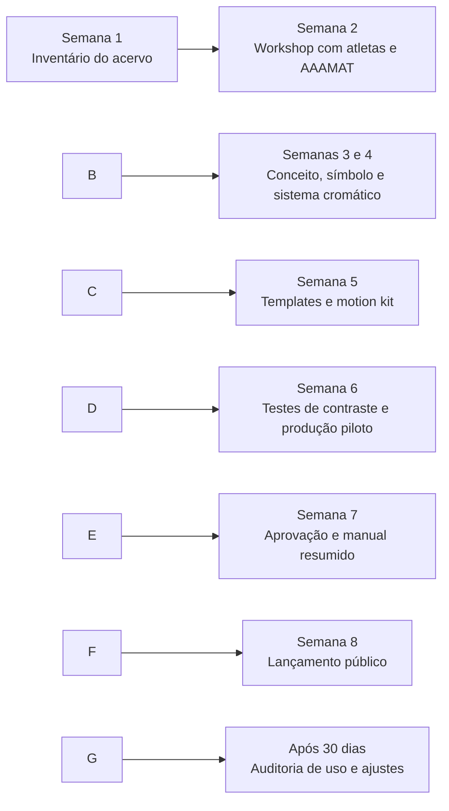

# Estudo de identidade visual do Handebol Masculino do IME-USP

## Resumo executivo

A identidade pública do Handebol Masculino do IME-USP, representada pelo perfil **@hmimeusp**, possui um núcleo simbólico claro: pertencimento ao IME-USP, tradição competitiva, orgulho coletivo e associação direta às cores **vermelha e branca**. A biografia pública sintetiza esse posicionamento com o lema “Vermelho e Branco até morrer”, a menção a oito títulos do BIFE e o vínculo explícito com a Atlética do IME, a **AAAMAT**. citeturn4search1

O componente mais consistente da comunicação recuperável é menos um sistema gráfico formal e mais um **sistema semântico**: uso recorrente dos emojis 🔴⚪️, linguagem de confronto esportivo, chamadas de jogo, celebração de atletas, memória de campeonatos e humor interno. Publicações recentes indexadas repetem enquadramentos como “🔴⚪️ … ⚪️🔴”, além de símbolos de confronto, partes do corpo, bandeiras e troféus, formando uma assinatura verbal-emojigráfica reconhecível. citeturn15search4turn16search0turn16search2turn21search3turn21search4

Em comparação, **@atleticaimeusp** funciona como uma marca-guarda-chuva muito mais ampla. A conta precisa comunicar modalidades esportivas, produtos, recepção estudantil, festas e eventos como JunIME, HallowIME, I Will SurvIME e BIFE. Por isso, apresenta maior variação temática, cromática e narrativa, recorrendo ao mascote **Fluffy**, a trocadilhos com “IME” e a uma voz inclusiva, informal e comunitária. citeturn4search9turn19search2turn19search7turn19search8turn19search19turn19search24

O principal diagnóstico é que o Handebol Masculino possui **marca cultural forte, mas sistema visual insuficientemente documentado**. Não foi possível verificar, com segurança, uma família tipográfica fixa, uma grade recorrente, regras de aplicação do escudo, capas padronizadas de destaques ou um conjunto estável de templates. O acesso automatizado direto aos feeds foi limitado pelo Instagram; portanto, a frequência apresentada neste estudo é ordinal e baseada em páginas, legendas, títulos e publicações públicas indexadas, não em uma extração integral do histórico. citeturn1view0turn1view1

A recomendação central é adotar uma arquitetura de marca em três níveis:

1. **Marca esportiva principal:** Handebol Masculino IME-USP.
2. **Endosso institucional:** AAAMAT, aplicado de maneira constante e secundária.
3. **Herança institucional:** IME-USP e USP, respeitando estritamente os respectivos manuais oficiais. citeturn4search5turn9search0turn9search1

O sistema proposto mantém vermelho e branco como núcleo, incorpora o vinho institucional do IME, reserva dourado para conquistas e cria uma linguagem visual modular baseada em linhas de quadra, geometria matemática, fotografia de ação e tipografia condensada. Essa solução melhora reconhecimento, legibilidade, produção descentralizada e compatibilidade com a identidade da Atlética, sem tornar o time visualmente indistinguível das demais modalidades.

## Escopo, método e confiabilidade

A análise priorizou as duas fontes solicitadas: **@hmimeusp** e **@atleticaimeusp**. Foram examinados resultados públicos indexados das páginas de perfil e de publicações representativas, contemplando chamadas de partidas, venda de uniformes, memória esportiva, apresentação de integrantes, vídeos, eventos, campanhas institucionais e conteúdo de comunidade. O site oficial da AAAMAT foi utilizado para confirmar suas atribuições, relação com as modalidades, produtos e canais oficiais. citeturn4search1turn20search0turn20search1turn20search5turn20search7

A frequência foi classificada como **alta**, **média**, **baixa/sazonal** ou **não observável**. Essas categorias expressam recorrência no recorte indexado, não porcentagens do universo completo de posts. Stories expirados, arquivo integral de stories, insights internos, métricas de alcance, arquivos-fonte, versões vetoriais e histórico completo de capas de destaques não estavam disponíveis; por isso, esses elementos são explicitamente marcados como não especificados.

|Fonte|Aplicação no estudo|Confiabilidade|
|-|-|-:|
|Perfis e publicações do Instagram|Tom de voz, temas, slogans, recorrência de símbolos e tipos de conteúdo|Alta para texto e posicionamento; média ou baixa para detalhes gráficos não renderizados|
|Site oficial da AAAMAT|Função institucional, modalidades, produtos e canais oficiais|Alta|
|Manual oficial do IME-USP|Cores institucionais, assinaturas e relação IME–USP|Alta|
|Portal de identidade visual da USP|Regras de preservação da marca institucional|Alta|
|Literatura brasileira sobre branding esportivo|Contextualização de símbolos, fidelização e extensão de marca|Moderada; utilizada apenas como apoio conceitual|
|WCAG em português e eMAG|Parâmetros objetivos de contraste e acessibilidade|Alta|

A AAAMAT declara ser responsável pela inscrição e organização das modalidades do IME, por eventos de integração e por produtos personalizados; a receita da lojinha é destinada, entre outras finalidades, ao apoio às equipes e ao pagamento de inscrições. Isso torna a identidade do handebol não apenas uma manifestação estética, mas parte de um ecossistema de recrutamento, financiamento, competição e pertencimento. citeturn4search8turn20search5turn20search7

Como referência contextual, estudos brasileiros de identidade esportiva enfatizam que cores e símbolos funcionam como ativos de reconhecimento e memória dos clubes, enquanto trabalhos sobre marketing esportivo universitário associam esporte, imagem institucional, relacionamento e fidelização. Essas fontes são úteis para interpretar o caso, mas não substituem a observação das contas do IME. citeturn9search3turn9search7turn9search17turn9search29

## Catálogo dos ativos observados

|Categoria|Handebol Masculino — @hmimeusp|AAAMAT — @atleticaimeusp|Situação|
|-|-|-|-|
|**Nome principal**|“Handebol Masculino IME - USP”|“A.A.A. Matemática” / AAAMAT|Claramente observado|
|**Lema**|“Vermelho e Branco até morrer”|O mesmo lema aparece historicamente associado à Atlética|Claramente observado citeturn4search1turn20search4|
|**Posicionamento competitivo**|Menção a oito títulos do BIFE; comunicação centrada em jogos, atletas e resultados|Marca-guarda-chuva de esporte, integração, produtos e eventos|Claramente observado citeturn4search1turn4search8|
|**Logo ou escudo exclusivo**|Há avatar e assinatura de perfil, mas a geometria do eventual escudo não pôde ser auditada em resolução suficiente|A existência do “Logo AAAMAT” é confirmada no site oficial|Parcialmente observado citeturn4search8turn20search5|
|**Cores declaradas**|Vermelho e branco|Vermelho e branco como cores de pertencimento da Atlética|Alta confiança citeturn4search1turn4search2turn20search4|
|**Códigos cromáticos efetivamente usados no Instagram**|Não especificados|Não especificados|Não observável com segurança|
|**Tipografia efetiva**|Não foi possível identificar família, peso ou licença|Varia conforme evento e campanha; família institucional não verificável no recorte|Não especificada|
|**Iconografia**|🔴, ⚪️, 🆚, 🏆, bandeiras, símbolos corporais e esportivos|Fluffy, emojis festivos, bandeiras, símbolos de festa e inclusão|Recorrente citeturn15search0turn15search4turn19search2turn19search7turn19search19|
|**Mascote**|Não foi identificado mascote próprio do handebol|Fluffy é personagem recorrente e porta-voz da Atlética|Observado somente na marca-mãe citeturn4search9turn19search2turn19search24|
|**Fotografia**|Jogos, atletas, equipe, uniformes e memórias de campeonatos|Eventos, espaços da USP, comunidade, produtos e campanhas|Conteúdo observado; tratamento de cor não verificável|
|**Padrões gráficos**|Não foi confirmado padrão geométrico ou textura estável|Campanhas parecem possuir universos temáticos próprios|Não especificado formalmente|
|**Grades e layouts**|Não foi possível comprovar uma grade fixa|Forte variação por campanha e finalidade|Não especificado|
|**Templates**|Há séries recorrentes por conteúdo, mas não se comprovou um template visual único|Há famílias temáticas para festas, avisos e eventos|Parcialmente observado|
|**Capas de destaques**|Não observáveis|Não observáveis|Não especificado|
|**Motion design**|Reels esportivos e séries em vídeo; transições e animações não verificáveis|Reels de tour, nostalgia, humor e divulgação de eventos|Formato observado; linguagem de edição não especificada citeturn16search1turn16search3turn19search2turn19search12turn19search18|

A paleta exata do Instagram não pôde ser extraída. Entretanto, o Manual de Identidade Visual do IME fornece uma referência institucional legítima: vinho **RGB 130, 20, 60**, equivalente a **#82143C**; dourado **RGB 230, 175, 60**, equivalente a **#E6AF3C**; e azul **RGB 0, 100, 160**, equivalente a **#0064A0**. Esses valores pertencem ao sistema institucional do IME e não devem ser apresentados como códigos atualmente usados pelo handebol sem confirmação dos arquivos originais. citeturn11search1turn12search0

|Papel cromático|Cor|HEX|RGB|Origem|
|-|-:|-:|-:|-|
|Vinho institucional||`#82143C`|130, 20, 60|Manual do IME|
|Dourado institucional||`#E6AF3C`|230, 175, 60|Manual do IME|
|Azul institucional||`#0064A0`|0, 100, 160|Manual do IME|
|Vermelho esportivo atual||**Não especificado**|**Não especificado**|Apenas semanticamente observado|
|Branco||`#FFFFFF` como referência técnica|255, 255, 255|Aproximação operacional, não medição do feed|

Exemplos públicos representativos do repertório analisado:

|Exemplo|Função de comunicação|Relevância para a identidade|
|-|-|-|
|“Último jogo do semestre”|Chamada de partida|Demonstra comunicação de serviço associada ao enquadramento vermelho e branco. citeturn5search0|
|Venda de uniformes|Produto e pertencimento|Indica que o uniforme é ativo de marca, arrecadação e identificação coletiva. citeturn5search1turn20search5|
|Memória do BIFE de 2019|Tradição e legado|Conecta o presente esportivo à história competitiva do time. citeturn15search2|
|Série sobre integrantes|Humanização do elenco|Cria reconhecimento individual e vínculo comunitário. citeturn15search3turn21search1turn21search4turn21search6|
|Melhor de três contra a Medicina|Rivalidade e expectativa|Exemplo de narrativa seriada de confronto. citeturn15search0turn21search3|
|Tour do CEPEUSP com Fluffy|Serviço com personagem|Mostra o mascote como mediador de informação institucional. citeturn4search9|
|Retrospectiva do BIFE com Fluffy|Memória coletiva|Demonstra como a AAAMAT usa personagem e nostalgia para coesão. citeturn19search2|
|JunIME, HallowIME e I Will SurvIME|Campanhas temáticas|Evidenciam a flexibilidade e a fragmentação controlada da marca-mãe. citeturn19search3turn19search8turn19search19|

## Frequência, contexto e voz

A tabela abaixo apresenta frequência ordinal no material público recuperado.

|Ativo ou comportamento|@hmimeusp|@atleticaimeusp|Contexto predominante|
|-|-:|-:|-|
|Vermelho e branco como código de pertencimento|**Alta**|**Alta**|Biografia, chamadas, uniformes e orgulho institucional|
|Emojis como moldura de título|**Alta**|**Média/alta**|Abertura de legendas, confronto e sinalização temática|
|Chamadas de jogo|**Alta**|**Média**|Calendário competitivo e mobilização de torcida|
|Resultado, conquista e memória competitiva|**Alta**|**Média/alta**|BIFE, Copa USP, NDU e retrospectivas|
|Apresentação de atletas|**Média/alta**|**Baixa**|Humanização, despedidas, recepção e elenco|
|Produtos e uniformes|**Baixa/sazonal**|**Média/sazonal**|Encomendas, apoio financeiro e vestuário de pertencimento|
|Mascote Fluffy|**Ausente ou não observado**|**Alta**|Tour, nostalgia, humor e chamada de eventos|
|Campanhas com identidade própria|**Baixa**|**Alta**|Festas, recepção, eventos e produtos|
|Conteúdo em vídeo curto|**Média**|**Alta**|Humor, bastidores, tours, divulgação e nostalgia|
|Stories e destaques|**Não observável**|**Não observável**|Arquivo não acessível|

O **tom do Handebol Masculino** combina quatro registros. O primeiro é competitivo e mobilizador: “jogo”, “confronto”, “melhor de três”, “último jogo” e referências a campeonatos. O segundo é afetivo e comunitário, sobretudo nas publicações sobre integrantes e memórias. O terceiro é informal, com humor de administração de página e expressões como “reanimação do adm”. O quarto é celebratório e histórico, apoiado no BIFE e nas conquistas do time. citeturn5search0turn15search0turn15search2turn21search0turn21search1

A **voz da AAAMAT** é mais expansiva e performática. Há uso frequente de trocadilhos com “IME”, superlativos festivos, chamadas diretas, linguagem inclusiva — “imeanes”, “todes”, “preparade” — e personagens que anunciam ou vivenciam as ações. Essa linguagem é coerente com a finalidade declarada da Atlética de promover esporte, integração e eventos para a comunidade do Instituto. citeturn4search8turn4search9turn19search7turn19search10turn19search11turn19search19

A arquitetura verbal recomendada para o handebol deve preservar essa espontaneidade, mas estabelecer prioridades:

|Situação|Tom recomendado|Exemplo de estrutura|
|-|-|-|
|Chamada de jogo|Direto, enérgico e informativo|“Dia de jogo. IME × adversário. Data, hora e local.”|
|Resultado|Competitivo sem hostilidade|“Fim de jogo. Resultado, destaques e próximo compromisso.”|
|Apresentação de atleta|Próximo e humano|“Nome, posição, número, trajetória e uma curiosidade.”|
|Conquista|Solene e coletivo|“Título, competição, elenco e agradecimentos.”|
|Recrutamento|Acolhedor e inclusivo|“Não é necessário ter experiência. Venha conhecer o treino.”|
|Humor|Interno, mas compreensível|Evitar piadas que dependam de informação inexistente na publicação|
|Rivalidade|Provocação esportiva controlada|Foco na quadra; evitar humilhação pessoal ou institucional|

O lema “Vermelho e Branco até morrer” deve continuar como ativo patrimonial, mas não precisa encerrar todos os posts. Recomenda-se empregá-lo em finais, jogos decisivos, lançamentos de uniforme e conquistas, evitando que a repetição automática reduza seu impacto.

## Comparação e diagnóstico

|Atributo|Handebol Masculino IME-USP|AAAMAT|Identidade esportiva universitária típica|
|-|-|-|-|
|**Função principal**|Representar uma modalidade e formar comunidade em torno do time|Representar várias modalidades, eventos, produtos e integração|Representar instituição, atletas e torcida|
|**Centro narrativo**|Jogo, elenco, desempenho, memória e pertencimento|Vida universitária, esporte, festas, produtos e serviços|Competição, tradição, mascote, cores e experiência coletiva|
|**Cores nucleares**|Vermelho e branco|Vermelho e branco, com ampla variação de campanha|Normalmente duas cores principais e neutros|
|**Símbolo recorrente**|Emojis cromáticos e referências ao IME; escudo formal não verificável|Logo AAAMAT e Fluffy|Escudo, monograma, mascote ou iniciais|
|**Mascote**|Não identificado|Fluffy|Frequentemente utilizado para entretenimento e comunidade|
|**Tom**|Competitivo, afetivo, informal e humorístico|Festivo, inclusivo, irreverente e informativo|Mobilizador, identitário e comunitário|
|**Variedade visual necessária**|Moderada|Muito alta|Moderada; aumenta em eventos especiais|
|**Risco principal**|Dependência de linguagem informal sem um sistema formal persistente|Fragmentação entre muitas campanhas|Inconsistência causada por produção descentralizada|
|**Oportunidade**|Criar uma marca de modalidade distintiva, endossada pela AAAMAT|Oferecer infraestrutura visual compartilhada às modalidades|Transformar símbolos em reconhecimento, produtos e fidelização|

No esporte, cores, símbolos e aplicações repetidas funcionam como mecanismos de reconhecimento e memória; no contexto universitário, a identidade também precisa apoiar recrutamento, integração e relacionamento institucional. citeturn9search3turn9search7turn9search17turn9search29

A consistência do @hmimeusp pode ser separada em dois níveis:

|Dimensão|Avaliação|Fundamentação|
|-|-:|-|
|**Consistência semântica**|**Forte**|Vermelho e branco, IME, competição, equipe, BIFE e orgulho aparecem de forma recorrente.|
|**Consistência verbal**|**Moderada/forte**|Há voz própria e enquadramentos recorrentes, mas o grau de informalidade varia.|
|**Consistência cromática mensurável**|**Indeterminada**|Não foi possível extrair códigos ou verificar uniformidade entre arquivos.|
|**Consistência tipográfica**|**Indeterminada**|Família e hierarquia tipográfica não foram confirmadas.|
|**Consistência de layout**|**Indeterminada/moderada**|Existem categorias recorrentes, mas não se comprovou uma grade fixa.|
|**Governança editorial**|**Moderada/frágil**|A própria conta menciona período de ausência e retorno do administrador. citeturn21search0|
|**Integração com a AAAMAT**|**Forte no discurso**|A Atlética aparece na biografia, em interações e na estrutura institucional das modalidades. citeturn4search1turn19search23turn20search7|
|**Integração com IME-USP/USP**|**Conceitualmente forte; formalmente não auditada**|O nome usa IME-USP, mas a conformidade gráfica depende dos arquivos e manuais oficiais.|

As principais divergências ou riscos são:

* **Ausência de especificação pública:** não há evidência acessível de manual próprio, kit de templates ou biblioteca de componentes.
* **Dependência do administrador:** a comunicação pode mudar radicalmente a cada gestão ou responsável.
* **Mistura entre marca do time e marca da Atlética:** sem arquitetura clara, o handebol pode parecer apenas mais um conteúdo da AAAMAT ou, no extremo oposto, perder endosso institucional.
* **Uso excessivo de elementos informais:** emojis e humor são ativos úteis, mas não substituem hierarquia, legibilidade, data, local, adversário e assinatura.
* **Variação temática da AAAMAT:** é natural que festas e eventos tenham universos próprios, mas o handebol deve manter uma base estável para não herdar toda a volatilidade cromática da marca-mãe. A diversidade de campanhas da Atlética é visível em I Will SurvIME, JunIME, HallowIME e BIFE. citeturn19search2turn19search3turn19search8turn19search19

## Sistema recomendado e acessibilidade

A proposta não busca substituir a AAAMAT nem a identidade institucional do IME. O objetivo é criar uma **submarca endossada**:

> \*\*Handebol Masculino IME-USP\*\*
> \*Modalidade oficial da AAAMAT\*

O sistema deve utilizar um símbolo esportivo próprio apenas se houver validação interna. Uma solução adequada seria um monograma **HM–IME**, uma bola de handebol geométrica ou uma composição inspirada simultaneamente nas linhas da quadra e em módulos matemáticos. O busto de Arquimedes e o logotipo da USP não devem ser redesenhados, estilizados ou fundidos ao escudo; devem ser aplicados apenas a partir dos arquivos oficiais e conforme os manuais institucionais. citeturn4search5turn9search0turn9search1

|Papel|Cor recomendada|HEX|RGB|Regra|
|-|-|-:|-:|-|
|Primária institucional|Vinho IME|`#82143C`|130, 20, 60|Fundos, títulos, assinatura e uniformes institucionais|
|Primária esportiva|Vermelho esportivo|`#B5122B`|181, 18, 43|Energia, placares, chamadas e detalhes|
|Sombra|Vinho profundo|`#5E0B22`|94, 11, 34|Sobreposições, degradês discretos e peças solenes|
|Base clara|Branco|`#FFFFFF`|255, 255, 255|Texto invertido e áreas de respiro|
|Base editorial|Off-white|`#F7F4F2`|247, 244, 242|Carrosséis e posts informativos|
|Neutro|Carvão|`#111111`|17, 17, 17|Texto corrido e contraste|
|Conquista|Dourado IME|`#E6AF3C`|230, 175, 60|Medalhas, finais e títulos; máximo de 10% da composição|
|Co-branding|Azul institucional|`#0064A0`|0, 100, 160|Somente quando necessário em aplicações oficiais IME/USP|

Os códigos vinho, dourado e azul têm origem no manual institucional do IME; vermelho esportivo, vinho profundo, off-white e carvão são extensões propostas para o sistema do handebol. citeturn11search1turn12search0

A tipografia recomendada é:

|Uso|Família sugerida|Pesos|
|-|-|-|
|Títulos, placares e chamadas|**Barlow Condensed**|SemiBold, Bold e ExtraBold|
|Texto informativo e legendas gráficas|**Inter**|Regular, Medium e Bold|
|Alternativa institucional|**Source Sans 3**|Regular, SemiBold e Bold|
|Números de placar|Barlow Condensed ou fonte específica do uniforme|ExtraBold, com algarismos tabulares quando disponível|

Não se recomenda atribuir essas famílias retroativamente às peças existentes: a tipografia atual permaneceu **não especificada**. As fontes sugeridas formam um novo sistema operacional, escolhido por oferecer contraste entre títulos atléticos condensados e textos informativos neutros.

As regras de marca propostas são:

|Regra|Especificação|
|-|-|
|Área de proteção|Mínimo de `1x`, sendo `x` a altura da letra “H” do monograma|
|Tamanho mínimo digital|Símbolo isolado: 64 px; assinatura completa: 180 px de largura|
|Versões|Principal colorida, branca negativa, preta monocromática e vinho monocromática|
|Fundos fotográficos|Aplicar em placa sólida, degradê controlado ou área visualmente limpa|
|Endosso AAAMAT|Entre 25% e 40% da largura da marca principal|
|IME-USP e USP|Somente arquivos oficiais; não integrar ao desenho do escudo|
|Proibições|Não distorcer, inclinar, contornar, sombrear, recolorir livremente ou adicionar efeitos tridimensionais|
|Avatar|Símbolo simples, sem textos longos e com contraste suficiente no recorte circular|

Para posts, recomenda-se um arquivo-mestre de **1080 px de largura**, preferencialmente em proporção **3:4**, que está dentro da faixa atualmente aceita para fotografias pelo Instagram; Reels devem ser concebidos em 9:16, considerando também uma capa que permaneça legível nos recortes do perfil. citeturn23search0turn23search2turn23search5

A grade deve utilizar margens laterais de 72 px e um módulo de seis colunas. Cada peça terá, no máximo:

* uma mensagem principal;
* um bloco de serviço;
* uma fotografia ou ilustração dominante;
* uma assinatura do time;
* um endosso da AAAMAT.

|Template|Elementos obrigatórios|Uso|
|-|-|-|
|Dia de jogo|Competição, adversário, data, hora, local e assinatura|Convocação|
|Resultado|Placar, competição, destaques e próximo jogo|Pós-partida|
|Elenco|Retrato, nome, posição, número e informação humana|Apresentação|
|Recrutamento|Horário, local, nível de experiência e contato|Captação|
|Conquista|Título, ano, competição, elenco e parceiros|Datas históricas|
|Uniforme|Frente, costas, detalhes, preço, prazo e tabela de medidas|Venda|
|Nota oficial|Título, texto curto, data e assinatura|Informações institucionais|
|Agenda|Semana ou mês, jogos e treinos|Serviço recorrente|

As fotografias devem priorizar salto, contato, defesa, lançamento, expressão, celebração e relação com a torcida. Recomenda-se padronizar temperatura de cor, contraste e tratamento de pele, mas preservar a textura real da quadra. Retratos de elenco devem usar enquadramento e distância semelhantes, evitando misturar fotografias profissionais, recortes de baixa resolução e selfies em uma mesma série.

O padrão gráfico secundário pode combinar:

* linhas semicirculares da área de seis metros;
* marcações de nove metros;
* trajetórias pontilhadas de passe;
* malha modular inspirada em papel quadriculado;
* coordenadas, vetores e formas geométricas discretas;
* o recorte angular de uma bola de handebol.

Esses elementos devem funcionar como textura, nunca como competição visual com data, horário ou placar.

!\[Style tile e templates ilustrativos para a identidade do Handebol Masculino IME-USP](sandbox:/mnt/data/mockup\_identidade\_hmimeusp.png)

[Baixar o mockup ilustrativo em PNG](sandbox:/mnt/data/mockup_identidade_hmimeusp.png)

Os testes de contraste da paleta proposta são:

|Combinação|Contraste|WCAG AA para texto normal|
|-|-:|-:|
|Branco sobre vinho IME `#82143C`|**9,93:1**|Aprovado|
|Branco sobre vermelho esportivo `#B5122B`|**6,80:1**|Aprovado|
|Branco sobre vinho profundo `#5E0B22`|**13,58:1**|Aprovado|
|Carvão sobre off-white|**17,24:1**|Aprovado|
|Carvão sobre dourado|**9,50:1**|Aprovado|
|Vinho IME sobre dourado|**5,00:1**|Aprovado|
|Branco sobre dourado|**1,99:1**|**Reprovado**|

A WCAG 2.2 estabelece contraste mínimo de **4,5:1** para texto comum e **3:1** para texto ampliado. Assim, dourado nunca deve receber texto branco; deve ser combinado com carvão ou vinho. Informações não podem ser transmitidas apenas por cor: vitória e derrota, por exemplo, devem possuir rótulo, ícone ou texto, além da diferença cromática. citeturn22search0turn22search1turn22search10

Cada publicação visual deve receber texto alternativo objetivo, e vídeos devem conter legendas incorporadas. Recomendações brasileiras de acessibilidade destacam o texto alternativo como meio de acesso para pessoas cegas e com baixa visão; orientações para redes sociais sugerem descrições sucintas e informativas. citeturn22search15turn22search23turn22search26

## Implementação, cronograma e prioridades

O projeto deve começar por inventário e governança, não pelo redesenho do escudo. O risco mais relevante é produzir uma nova estética sem resolver armazenamento de arquivos, responsabilidade editorial, aprovação pela AAAMAT e continuidade entre gestões.

|Prioridade|Ação|Entregável|Critério de conclusão|
|-|-|-|-|
|**Crítica**|Reunir logos, uniformes, posts, fotos e arquivos antigos|Inventário organizado|Todo arquivo possui data, autor, formato e status|
|**Crítica**|Definir relação entre time, AAAMAT, IME-USP e USP|Diagrama de arquitetura de marca|Regras aprovadas pelos responsáveis|
|**Crítica**|Escolher ou validar símbolo do handebol|Marca vetorial|SVG, PDF, PNG e versões monocromáticas|
|**Crítica**|Fixar paleta, tipografia e contraste|Tokens de design|Todos os pares textuais atendem à WCAG AA|
|**Alta**|Criar templates essenciais|Kit para feed, stories e Reels|Templates editáveis e documentados|
|**Alta**|Padronizar fotografia|Guia de captação e edição|Presets e exemplos aprovados|
|**Alta**|Criar manual operacional|Documento de 12 a 20 páginas|Inclui usos corretos, incorretos e exemplos|
|**Alta**|Implantar biblioteca compartilhada|Pasta ou projeto no Figma|Permissões e estrutura independem de pessoa específica|
|**Média**|Reorganizar bio, links e destaques|Perfil revisado|Contatos, horários, conquistas e recrutamento atualizados|
|**Média**|Criar pacote de motion|Abertura, placar, escalação e encerramento|Peças exportáveis sem software especializado|
|**Média**|Planejar lançamento|Campanha de apresentação|Três posts, stories, Reel e uniforme demonstrativo|
|**Contínua**|Auditar consistência|Relatório trimestral|Amostra de posts avaliada por checklist|

A biblioteca mínima deve conter:

|Pasta|Conteúdo|
|-|-|
|`00\_Governanca`|Responsáveis, aprovações, contatos e licenças|
|`01\_Logos`|SVG, PDF, PNG, positivo, negativo e monocromático|
|`02\_Cores\_e\_Fontes`|Paleta, contrastes, fontes e instruções|
|`03\_Templates\_Feed`|Jogo, resultado, elenco, conquista, agenda e nota|
|`04\_Stories\_e\_Reels`|Capas, placares, contagem regressiva e lower thirds|
|`05\_Fotografia`|Originais, selecionadas e exportações|
|`06\_Uniformes`|Artes, mockups, fornecedores e tabelas de medidas|
|`07\_Arquivo`|Peças encerradas, separadas por temporada|

A aprovação de cada peça pode ser reduzida a seis perguntas:

1. A informação principal é compreendida em menos de três segundos?
2. Data, hora, local e adversário estão completos quando aplicáveis?
3. A peça é reconhecível como Handebol Masculino do IME sem depender da legenda?
4. O endosso da AAAMAT está correto e legível?
5. O contraste atende à WCAG AA e a informação não depende apenas de cor?
6. O arquivo final e o editável foram arquivados no local correto?

A próxima decisão lógica é **se o time precisa de um novo escudo ou apenas de um sistema de aplicação**. Com a evidência disponível, a prioridade deveria ser o sistema: paleta, tipografia, templates, fotografia, arquivo e governança. Um redesenho completo do escudo só se justifica após recuperar o arquivo atual em alta resolução e avaliar reconhecimento, legibilidade em avatar, bordado, uniformes e compatibilidade com a AAAMAT.

## Referências principais

ASSOCIAÇÃO ATLÉTICA ACADÊMICA DA MATEMÁTICA. **AAAMAT: página institucional**. São Paulo: Instituto de Matemática e Estatística da Universidade de São Paulo, \[s. d.]. A página descreve a função da entidade, sua atuação esportiva, eventos e produtos. citeturn4search8turn20search1

ASSOCIAÇÃO ATLÉTICA ACADÊMICA DA MATEMÁTICA. **Lojinha da Atlética**. São Paulo: IME-USP, \[s. d.]. Fonte primária sobre produtos, financiamento das equipes e variação de layouts entre gestões. citeturn20search5

ASSOCIAÇÃO ATLÉTICA ACADÊMICA DA MATEMÁTICA. **Modalidades**. São Paulo: IME-USP, \[s. d.]. Fonte primária sobre organização de modalidades, diretores e treinos. citeturn20search7

HANDebol MASCULINO IME-USP. **Perfil @hmimeusp e publicações públicas indexadas**. Instagram, 2021–2026. Fonte primária para lema, títulos, linguagem competitiva, uniformes, elenco e memória esportiva. citeturn4search1turn5search0turn5search1turn15search0turn15search2turn21search0

ASSOCIAÇÃO ATLÉTICA ACADÊMICA DA MATEMÁTICA. **Perfil @atleticaimeusp e publicações públicas indexadas**. Instagram, 2024–2026. Fonte primária para voz, Fluffy, eventos e campanhas temáticas. citeturn4search9turn19search2turn19search7turn19search8turn19search19turn19search24

INSTITUTO DE MATEMÁTICA E ESTATÍSTICA DA UNIVERSIDADE DE SÃO PAULO. **Manual de identidade visual**. São Paulo: IME-USP, 2021. Fonte institucional para cores, assinaturas e aplicações da marca. citeturn9search0turn11search1turn12search0

UNIVERSIDADE DE SÃO PAULO. **USP — Identidade visual**. São Paulo: Superintendência de Comunicação Social, versão 2025.001. Fonte oficial para preservação e aplicação da identidade visual da Universidade. citeturn9search1turn9search16

FRID, Marina Cukierman. **Branding nos esportes: uma análise sobre a marca dos clubes de futebol**. Rio de Janeiro: Universidade Federal do Rio de Janeiro, 2007. Referência contextual de qualidade intermediária, utilizada para princípios gerais de mobilização, associação e marca esportiva, não como evidência direta sobre o IME. citeturn9search3

SILVA, R. B. S. **Identidade visual aplicada nas ações de marketing dos clubes esportivos**. Brasília: Centro Universitário de Brasília, \[s. d.]. Referência contextual de qualidade intermediária sobre cores, símbolos e memória de torcedores. citeturn9search7

WORLD WIDE WEB CONSORTIUM. **Diretrizes de Acessibilidade para Conteúdo Web — WCAG 2.2: tradução autorizada para português brasileiro**. 2023. Fonte normativa principal para contraste, imagens de texto e acessibilidade visual. citeturn22search0turn22search3

BRASIL. Governo Federal. **Modelo de Acessibilidade em Governo Eletrônico — eMAG**. Brasília, \[s. d.]. Fonte brasileira complementar para contraste, independência de cor e acessibilidade digital. citeturn22search1turn22search7turn22search10
