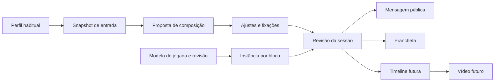

# Arquitetura e metodologia propostas

Contratos recomendados; não são funcionalidades implementadas nem autorização de migração.

Reusar plano/sessão/série/conteúdo e revisões existentes. IDs de sessão de presença e Playbook são distintos. Sessão Playbook pode existir sem calendário.

## Avaliação habitual

Proposta: ATTACK, DEFENSE e GOALKEEPER com ordenações independentes, time, atleta, revisão, autor e data. Não copiar LINE para duas dimensões: preservar legado informativo e solicitar avaliação explícita. Preservar GOALKEEPER se sua semântica for validada. Atleta híbrido não precisa escolher exclusivamente linha ou gol.

Pergunta: “Considerando o desempenho habitual de ataque ao longo dos treinos, como X se compara a Y?” Defesa tem contexto próprio. Melhor/pior/mesmo nível preservam o fluxo; “não tenho evidência suficiente” não cria nota. Cansaço pontual não altera perfil automaticamente. Reavaliar uma dimensão não modifica outra. Mudança concorrente de camadas invalida a comparação baseada em revisão antiga.

## Metodologia e limites

Camadas são ordinais; distância entre camadas não mede capacidade. Recomenda-se mostrar distribuição por dimensão e usar heurística transparente, determinística e versionada. Não prometer probabilidade de vitória, gols ou ótimo global.

Opção numérica **a aprovar**: percentil de ordem por dimensão/time, com empate médio e população de referência congelada para todos os candidatos. Para n>1, `q=(r-1)/(n-1)`, com r posição média na ordem fraco→forte. n<2 não oferece discriminação útil. É posição relativa, não habilidade cardinal. Registrar população/revisão; não normalizar separadamente por equipe candidata. Desconhecido: q=null.

Com tamanhos iguais e cobertura completa, calcular separadamente médias ofensivas A_A/A_B e defensivas D_A/D_B. Equilibrado considera vetor `(|A_A-A_B|, |D_A-D_B|)`, distribuições e pior diferença. Minimax das diferenças é opção após aceite, pois pesos/normalização são convenções. Sem cobertura completa: mostrar conhecidos/total por dimensão, métricas parciais qualificadas e não certificar equilíbrio. Não premiar equipe com lacunas por média somente dos conhecidos; desconhecidos seguem elegíveis por posição e distribuíveis manualmente.

Exibir ambos os sentidos como cartões “ataque A + defesa B” e “ataque B + defesa A”, com cobertura e perfis lado a lado. **Não subtrair ataque e defesa como se as escalas fossem calibradas.** Contraste de posições relativas pode ser alerta heurístico, não previsão de dificuldade. Evitar direção muito desfavorável requer inspeção explícita da CT enquanto não houver calibração.

Direcionado: técnico escolhe o grupo atacante do foco principal; buscar ataque relativamente alto desse grupo e defesa relativamente alta do outro, com critérios separados/Pareto. Mostrar inverso e suplentes; não assumir que forte defensor ataca mal. Mesmo motor para papéis do bloco e times do coletivo; contexto define vagas, não disponibilidade do modo.

Busca começa por elegibilidade/fixações, gera candidatos sob orçamento de tempo/nós, apresenta critérios separados e desempata por IDs estáveis. Informar truncamento e versão do método. Prioridade entre posições, equilíbrio e minutos está aberta: apresentar alternativas não dominadas até decisão, sem herdar silenciosamente pesos do legado. Equilibrado é o default; ambos os modos têm a mesma hierarquia visual.

## Contratos mínimos propostos

| Objeto | Campos e invariantes |
|---|---|
| Avaliação | team_id, member_id, dimension, layer_id ou desconhecido, revision, author, assessed_at. |
| Entrada | Participantes e origem de inclusão, confirmação separada, posições efetivas, avaliações ou null, revisões da fonte. |
| Composição | schema_version, session_id Playbook, block_id estável, mode, direction, snapshot, constraints, assignments, diagnostics, method_version. |
| Ocupação | slot_id estável, role, member_id ou null, origem manual/automática, occupant_locked; pessoa não ocupa vagas simultâneas duplicadas. |
| Instância | content_id/template_revision, mapa slot_id→member_id, coordenadas/overrides; substituir pessoa não modifica modelo. |
| Revisão | revision_id, base_revision, autor, instante, snapshot; escrita condicional e histórico append-only. |
| Mensagem | source_revision, audience, generated_at, versão do renderizador e texto derivado; sem notas internas. |
| Diagnóstico | Conflitos de fixação, vagas/elegibilidade, cobertura por dimensão, busca truncada e impacto antes/depois. |

APIs candidatas, **não existentes**: POST `/api/v1/playbook/sessions/{session_id}/composition/preview` sem persistir; PUT `.../composition` com base_revision; GET `.../revisions/{revision_id}/message` derivado da revisão. Rever integração antes de criar endpoints. Validar corpo/tamanho, autor do contexto autenticado, time da sessão, CSRF e permissão no servidor. Conflito de revisão retorna 409 recuperável. Idempotência móvel impede duplicar revisões em retry.

`local_overrides` existente não é atalho: novo significado persistente precisa contrato tipado, limites, compatibilidade e classificação DB_MIGRATION. Não esconder estrutura em notes/steps. Comparar extensão versionada versus tabelas dedicadas por consultas/auditoria; documentar plano antes de solicitar autorização de persistência.

## Salvamento e coerência

Rascunho → preview → revisão salva → mensagem/prancheta. Rascunho alterado não se apresenta como salvo. Undo/redo opera no rascunho; restaurar revisão salva cria nova revisão. Recalcular conserva fixações e oferece diff antes de aplicar. Mudança de participantes/perfis marca entrada desatualizada; adoção explícita cria revisão. Mensagem copiada não pode ser recolhida: marcar versão antiga e gerar substituta. Copiar não comprova envio.

## Tempo e vídeo

Coordenadas no espaço da quadra, independentes de pixels/orientação; identidade permanente dos slots. Timeline futura: etapas com ID/duração em milissegundos, trajetórias por slot, passes origem/destino, posse e finalização; simultaneidade explícita. Validar duração positiva, referências e continuidade. Imagem estática não define isso.

Reprodução calcula posição pelo tempo absoluto, sem depender de FPS: play/pause/seek/replay. Troca de ocupante preserva trajetórias; remoção de slot referenciado exige resolução. Vídeo usa o mesmo avaliador temporal e revisão imutável, com resolução/FPS/formato, fila iniciada pelo usuário, cancelamento, limites e retenção. Não exige IA generativa nem custo de API; medir CPU/armazenamento e validar codecs/fontes/instalação Windows. Nenhum renderizador deve ser instalado nesta tarefa documental.
